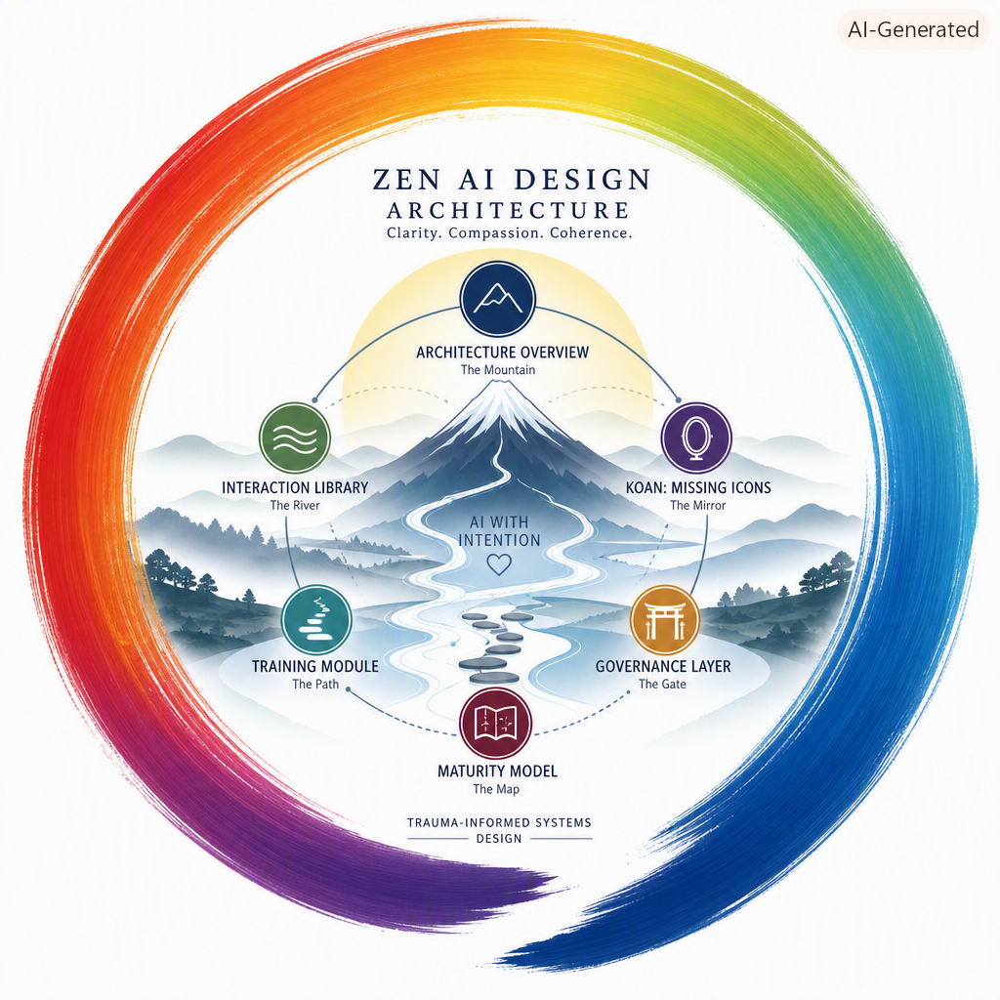

# **Trauma‑Informed Systems Design (TISD)**  
### Emergent Frameworks for Safe, Predictable, Dignified Institutional Processes

*A visual overview of the Zen AI Design Architecture framed within a rainbow enso, symbolizing clarity, compassion, and coherence.*

---

# 🏗 Under Construction  
This repository is part of a **broader NDH ecosystem** that is still in active research and development.  
Some components — including the full research pipeline, NDH‑Platforms, and several advanced mathematical layers — are **not yet stabilized**.

TISD follows a **non‑linear development philosophy**:

- emergence is expected  
- stability arrives gradually  
- clarity increases over time  
- and some parts of the system will *always* evolve  

The **under‑construction note will be removed** once the architecture reaches a sufficient maturity level.

---

# 🌱 Purpose  
**Trauma‑Informed Systems Design (TISD)** documents emergent, trauma‑informed architectural methods for designing workflows within large institutions.  
It provides patterns for building processes that remain safe, predictable, and dignified for individuals navigating trauma, communication barriers, or transnational vulnerability.

This repository preserves **full provenance** of its development.  
Artifacts emerge iteratively, but dignity remains constant.

---

# 📚 Contents  
- **`case-studies/`** — anonymized real‑world redesign scenarios  
- **`invariants/`** — communication and structural invariants for safe participation  
- **`generators/`** — specifications for trauma‑informed process generation  
- **`frameworks/`** — modular building blocks for institutional workflow design  
- **`docs/`** — NDH cognitive‑access models, governance notes, and conceptual architecture  
- **`architecture/`** — Zen AI Design architecture, interaction patterns, koans, governance layers, and maturity models  

---

# 🧩 Core Principles  
This repository is grounded in several foundational ideas:

- **Dignity is a design invariant**  
- **Predictability is accessibility**  
- **Single‑channel communication reduces cognitive load**  
- **Trauma‑informed design strengthens compliance and oversight**  
- **NDH holonomy‑flattening prevents recursive self‑advocacy loops**  
- **Non‑linear development is normal and expected**  
- **Transnational repression requires specialized procedural safeguards**  

These principles guide every artifact in this repo.

---

# 🏔 Zen AI Design Architecture (Orientation)

The `architecture/` folder contains the **six foundational artifacts** of Zen AI Design — the cognitive‑access layer of TISD.  
If you feel overwhelmed by the advanced math or GBS layers, start here.

### **ZenAIDesignArchitectureOverview — the mountain**  
The high‑level view of the entire system.

### **ZenAIDesignInteractionLibrary — the river**  
Where interaction patterns, gestures, and flows are defined.

### **ZenAIDesignKoan-MissingIcons — the mirror**  
A canonical koan teaching awareness of drift and clarity restoration.

### **ZenAIDesignTrainingModule — the path**  
A structured learning sequence for practicing Zen AI Design.

### **ZenAIDesignGovernanceLayer — the gate**  
Where structure meets clarity and holonomy is enforced.

### **ZenAIDesignMaturityModel — the map**  
A progression model for practitioner development.

These six artifacts provide a **gentle, structured entry point** into the broader NDH ecosystem.

---

# 🧮 Mathematical Backbone  
TISD is supported by the **GBS Transformation Map**, a mathematically grounded pipeline:

1. **Manifold Mapping**  
2. **Tensor Construction**  
3. **Vector Field Extraction**  
4. **Scalar Misalignment**  
5. **Stability Envelope Evaluation**  
6. **Holonomy Detection**  
7. **Canonical Output Formation**

This math ensures:

- non‑absorptive semantics  
- trauma‑safe boundaries  
- predictable transformations  
- invariant preservation  
- representational stability  

The representation stack includes:

- **Numeric Layer**  
- **SVG Layer**  
- **Metadata Layer**  
- **Tensor‑Flow Layer**  

Each layer expresses the same canonical structure in a different representational form.

---

# 🛠️ Development Philosophy  
TISD evolves **non‑linearly**.  
Artifacts emerge when they are ready, not on a fixed timeline.

This repository:

- preserves provenance  
- respects dignity at every stage  
- avoids premature collapse into “finished” or “unfinished”  
- treats emergence as a valid architectural mode  
- maintains stability even during growth  

Non‑linear development is not a flaw — it is a trauma‑informed design choice.

---

# 📝 License (MIT)  
This repository is released under the **MIT License**, ensuring all frameworks, case studies, and generator specifications remain **open, accessible, and adaptable** for institutions, researchers, and developers.

Full license text is available in the `LICENSE` file.

---

# 🤝 Contributing  
Contributions are welcome once the initial architecture stabilizes.  
For now, please open issues for:

- conceptual refinements  
- accessibility concerns  
- trauma‑informed design suggestions  
- structural improvements  

---
