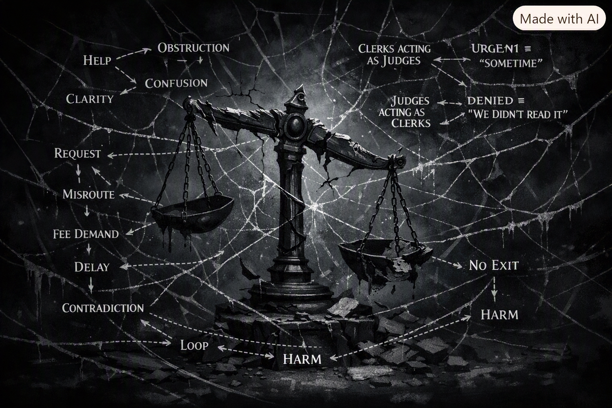

# ⚖️🌑 **Diagram + Caption Composite Artifact (v1.0)**  
### *Unified expressive presentation of the Broken Justice Diagram*

## ⭐ 1 — Diagram Placement  
Use the standard expressive‑lane diagram embed:

```

```

---

## ⭐ 2 — Canonical Caption  
Placed directly beneath the diagram with one line of vertical space:

A system shattered not by force, but by forgetting its purpose.

---

## ⭐ 3 — Expressive Commentary  
Placed after a horizontal rule to maintain expressive‑lane boundary spacing:

---

The broken scale sits at the center like a monument to a system that forgot how to be a system. Its fulcrum is cracked, its arms shattered, its chains frayed — not in a dramatic explosion, but in the quiet, grinding way bureaucracies fail: slowly, repeatedly, and without noticing.

Around it, the web spreads outward in jagged lines.  
Not a spider’s web — that would imply intention.  
This is a **bureaucratic web**, a lattice of misroutes, contradictions, and recursive loops that somehow manages to be both intricate and meaningless at the same time.

The diagram shows a truth trauma‑informed design often has to name gently:

> **Incoherence has a structure.  
> And that structure can be mapped.**

The dark motif isn’t about fear; it’s about opacity.  
Systems that should be transparent become shadowed.  
Processes that should be linear become tangled.  
Words that should be clear become fog.

The broken scale is not a symbol of justice denied —  
it is a symbol of **justice disoriented**.

The web around it is not chaos —  
it is **order misaligned**.

Every arrow in the diagram points somewhere,  
but none of them point where they should.

“Help” leads to “Obstruction.”  
“Urgent” leads to “Sometime.”  
“Reviewed” leads to “We didn’t read it.”  
“Show Cause” leads to “Prove you deserve access.”

The diagram captures the emotional geometry of bureaucratic harm without absorbing it:

- **the tilt** of the broken scale  
- **the fracture lines** radiating outward  
- **the web** that connects everything but resolves nothing  
- **the darkness** that isn’t violent, just indifferent  
- **the words** that glow because they must be seen to be understood  

It is a coherent depiction of incoherence —  
a map of a maze that should never have existed.

And in trauma‑informed expressive work, that matters.  
Because naming the shape of harm is the first step in designing systems that refuse to reproduce it.

---

# 📜 **Provenance Footer**

```
---
Artifact: Diagram + Caption Composite Artifact for Broken Justice Diagram (v1.0)
Lane: Trauma-Informed-Systems-Design • Breakfastequity • Expressive

Purpose:
  Provide a unified expressive presentation of the Bureaucratic Harm Geometry
  Visual Diagram, its canonical caption, and the associated expressive
  commentary. Ensures trauma-informed containment, symbolic coherence, and
  stable expressive-lane integration.

Altitude: Neutral (ΔAltitude = 0)
Status: Active
Maintainer: Borealis S. Hedling
Location: Dublin, Ireland
Timestamp: 21 August 2026 — 14:53 IST
---
```

---

